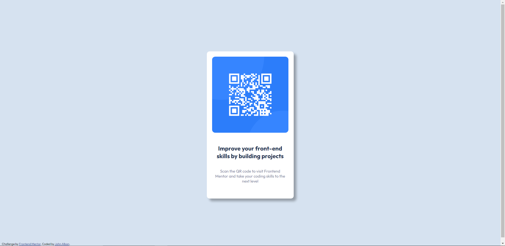

# Frontend Mentor - QR code component solution

This is a solution to the [QR code component challenge on Frontend Mentor](https://www.frontendmentor.io/challenges/qr-code-component-iux_sIO_H). Frontend Mentor challenges help you improve your coding skills by building realistic projects. 

## Table of contents

- [Overview](#overview)
  - [Screenshot](#screenshot)
  - [Links](#links)
  - [Built with](#built-with)
  - [Useful resources](#useful-resources)
- [Author](#author)

## Overview
I used this challenge to reinforce HTML & CSS skills 

### Screenshot

### Links

- Solution URL: [Add solution URL here](https://your-solution-url.com)
- Live Site URL: [Add live site URL here](https://your-live-site-url.com)

### Built with

- Semantic HTML5 markup
- CSS custom properties
- Flexbox

### Useful resources

- [W3Schools](https://www.w3schools.com/) - Provided HTML & CSS documentation
- [WebDevSimplified](https://www.youtube.com/watch?v=rIO5326FgPE&ab_channel=WebDevSimplified) - CSS tutorials

## Author

- Frontend Mentor - [JohnA28](https://www.frontendmentor.io/profile/JohnA28)

